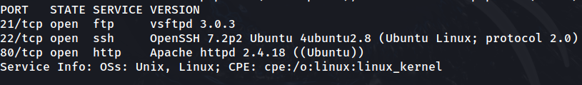

# Bounty Hacker

## Task 1

### 1.2

To discover open ports, I will use nmap.

```
sudo nmap -sS -sV -p- -v 10.10.206.215 -oN nmap.out
```



The server has an FTP server, an SSH server, and a HTTP server.

### 1.3

I will try to log anonymously into the FTP server.

```
ftp anonymous@10.10.206.215
```


Login successful. Will check the current directory for files that will help access the system.

Typing 'ls' enters passive mode. I can turn it off by typing 'passive'.


Directory contains two files, 'locks.txt' and 'task.txt'. locks.txt appears to be a password list, and task.txt is a list of tasks made by 'lin'.


### 1.4

The 'locks.txt' file can be useful for brute forcing SSH as the potential user 'lin'.

### 1.5

Will use hydra to brute force into the SSH server using the username 'lin' and the password list 'locks.txt'.

```
hydra -l lin -P locks.txt -vV 10.10.206.215 ssh -o hydra.out
```

The brute forced password for lin is 'RedDr4gonSynd1cat3'.


### 1.6

I will log into SSH with the username 'lin' and password 'RedDr4gonSynd1cat3'.


The user.txt file contains the first flag:

THM{CR1M3_SyNd1C4T3}

### 1.7

To access the 'root.txt' file, I need to escalate the user privileges. I will check the current user's permissions with 'sudo'

```
sudo -l
```


The current user can run /bin/tar with root privileges. Checking GTFOBins for privilege escalation with 'tar' gives the following exploit:

```
sudo tar -cf /dev/null /dev/null --checkpoint=1 --checkpoint-action=exec=/bin/sh
```

Executing the exploit in the target terminal gives me a root shell.


Going to root.txt file gives us the last flag:

THM{80UN7Y_h4cK3r}