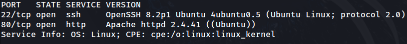
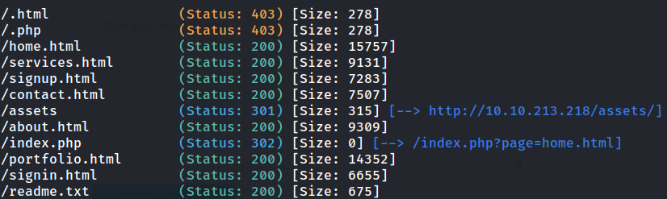
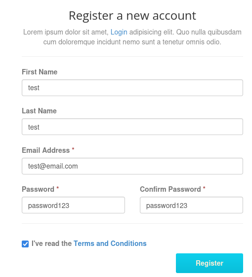

# Red

## Task 1

### 1.1

I will perform an nmap scan on the machine to check for open ports

```
sudo nmap -sS -sV -p- -v 10.10.213.218 -oN nmap.out
```



The server shows two servers: HTTP and SSH. The web server shows a simple website, created with WebThemez.


There are no exploits listed for 'WebThemez' websites on the Exploit DB, so further enumeration must be done.

I will brute force directories using gobuster.

```
gobuster dir -t 100 -u http://10.10.213.218 -w ~/wordlists/dirbuster/directory-list-2.3-medium.txt -x html,css,js,php,conf,txt -o gb_root.out
```

Gobuster revealed a sign-in and sign-up page, which opens the possibility to privilege escalation within the website.



I will sign up using dummy details to make logging in easier.



Sign in page and sign up page do not have functionality.

Since I don't see any vulnerabilities from using the website myself, I will use nikto to run a vulnerability scan on the website:

```
nikto -h 10.10.213.218 -o nikto.txt
```